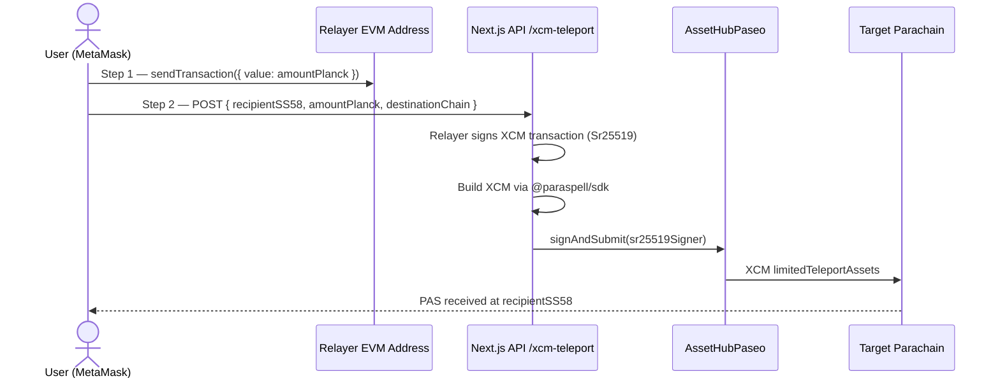

# SubPay

> The Payment & DeFi Layer of Polkadot, cross-chain payments, bill splitting, and shareable payment links built natively on Passet Hub.

---

## About the Project

SubPay is a full-stack DeFi payment dApp on Polkadot's EVM compatible testnet (Passet Hub, Chain ID `420420417`). It lets users send PAS, USDt, and USDC to any address, split bills with friends via on-chain group expense tracking, teleport PAS across 5 Paseo parachains using XCM, and share payment requests via PolkaLinks — all from a single clean interface connected to MetaMask.

---

## Vision

Make Polkadot the default payments layer for Web3. SubPay replaces fragmented wallet UX, manual address sharing, and off chain bill splitting with a unified, always-on payment experience, natively cross-chain, natively stablecoin

---

## Problem & Solution

| Problem | Solution |
|---|---|
| No unified payment UX on Polkadot EVM | Single interface for PAS + USDt + USDC payments |
| XCM is inaccessible to regular users | One-click cross-chain send via hybrid relayer |
| No on-chain group expense management | GroupSplit contract with debt tracking + real-time chat |
| No shareable payment links on Polkadot | PolkaLinks : shareable URLs + QR codes |
| Fiat users don't know PAS value | Live converter across 8 fiat currencies via CoinGecko |

---

## Technical Architecture

### Smart Contracts

| Contract | Address | Purpose |
|---|---|---|
| `PaymentRouter.sol` | `0xCc05B4aD5D96abb333c16CA7f4345DaeF7a62F4F` | P2P payments, bill split, XCM dispatch |
| `GroupSplit.sol` | `0x84a87Cd93F3A5C81Ba3179Aeff6ACC9e994bdA1c` | Group expenses, debt tracking, settlement |
| USDT Precompile | `0x000007C000000000000000000000000001200000` | ERC20 interface for Polkadot USDt |
| USDC Precompile | `0x0000053900000000000000000000000001200000` | ERC20 interface for Polkadot USDC |
| XCM Precompile | `0x00000000000000000000000000000000000A0000` | Substrate XCM exposed to EVM |

### XCM Cross-Chain Flow

**Supported destination parachains:**
`PeoplePaseo` · `AssetHubPaseo` · `BridgeHubPaseo` · `CoretimePaseo` · `NeuroWebPaseo`

### Stack

| Layer | Tech |
|---|---|
| Frontend | Next.js 16, Wagmi, RainbowKit, ethers.js v6, Tailwind CSS |
| Contracts | Solidity 0.8.20, Hardhat |
| XCM | @paraspell/sdk (server-side), Sr25519 signer |
| Real-time | Convex (group chat + payment links) |
| Prices | CoinGecko API |

---

